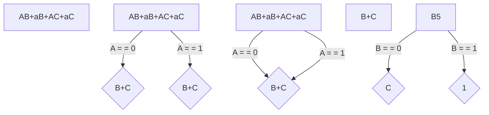
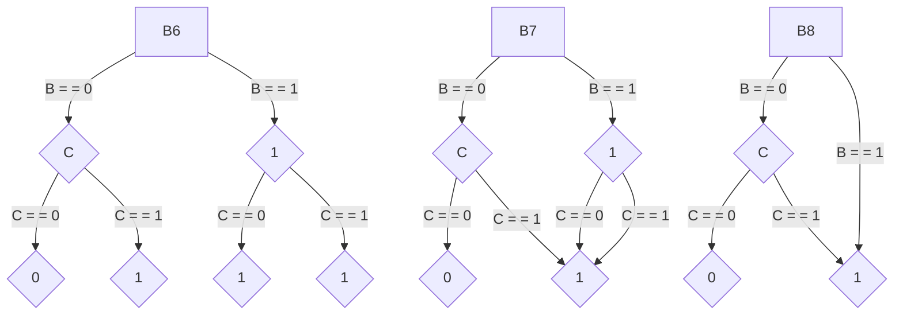

# Content

- Introduction
    - Used language
    - Machine attributes
- Implementation
    - `BDD_create(String expression, String order)`
        - Code
        - Algorithm
        - Testing
    - `BDD_createWithBestOrder(String expression)`
        - Code
        - Testing
    - `BDD_use(String input)`
        - Code
    - Example of creating and using a BDD
- Testing comparing

- Conclusion

---

# Introduction

The purpose of the second DSA task was to implement function logic in a program which has to create a Binary Decision
Diagram, to reduce it and also to use a relative input parameter - a vector.

## Used language

For this task I chose the language Java.

```powershell
PS C:\Users\kozub>java --version
openjdk 19.0.2 2023-01-17
OpenJDK Runtime Environment (build 19.0.2+7-44)
OpenJDK 64-Bit Server VM (build 19.0.2+7-44, mixed mode, sharing)
```

The reason for this is that I am more familiar with it and I have more
experience with it.

## Machine attributes

For testing - I decided to use a separate server from [GitHub Codespaces](https://github.com/features/codespaces), which
the loving GitHub provided us with for
free.

Below are the specifications of the processor on which our programme will be tested.

```
PS C:\Users\kozub> wmic cpu list /format:list
...
LoadPercentage=1
Manufacturer=GenuineIntel
MaxClockSpeed=2208
Name=Intel(R) Core(TM) i7-10870H CPU @ 2.20GHz
...
```

---

# Implementation

In my implementation I decided to create one BDD class with a Node, which is responsible for the whole structure and
reduction of the Binary Decision Diagram. The static Expression class is for additional functions, like generating
expressions and checking them. And also a Manager class - which provides the interaction interface and method execution.


_*Figure 1: Package structure_

---

## *`BDD_create(String expression, String order)`*

This method is responsible for creating a Binary Decision Diagram from a given expression and order. It returns a
reduced BDD.

> 📝 Memory complexity - **O(2^n)**
>
> ⌛ Time complexity - **O(n * 2^n)**
> *In the worst case, the algorithm will have to go through all the nodes of the BDD
>
> ⌛ Time complexity - **O(H)**
> *In the best case, the algorithm will have to go through only one path of the BDD, where H - height of the BDD

### Code

[//]: # (@formatter:off)
```java
/**
 * Creates a BDD from an expression and a variable order
 *
 * @param expression Expression to be used
 * @param order      Variable order to be used
 * @return BDD created from the expression and variable order
 */
public BDD create(String expression, String order) {

    if (validateVarTypes(expression, order) || expression.isBlank())
        return null;

    this.expression = expression;
    this.varTypes = order.toUpperCase().split("");
    this.numberOfNodesAfterReduction = 1;

    this.previous = new Node[1];
    this.current = new Node[2];
    this.setRoot(this.previous[0] = new Node(null, this.expression, 0));

    for (int i = 0; i < this.varTypes.length; i++)
        this.numberOfNodes += Math.pow(2, i);

    int num, pos = 0;
    while (++pos <= this.varTypes.length) {
        num = 0;
        for (Node node : this.previous) {
            if (node == null)
                continue;

            Node low = reduceExpression(node, node.getValue(), pos, this.varTypes, true);
            Node high = reduceExpression(node, node.getValue(), pos, this.varTypes, false);

            node.setLowChild(this.current[num++] = low);
            node.setHighChild(this.current[num++] = high);

            if (pos != this.varTypes.length)
                this.numberOfNodesAfterReduction += 2;
        }

        handleReduction(this);
        this.previous = this.current;
        this.current = new Node[this.previous.length * 2];
    }

    return this;
}
```
[//]: # (@formatter:on)

### Algorithm

The first step creates the first node containing the complete Boolean function and declares it to be the root of the
diagram.

The second step creates another layer with two child nodes, the left one containing an expression after adding
value 0 after adding the variable A, and the right one, in turn, contains an expression after adding the value 1.

Since after each addition of a new value in my function, a reduction is performed - since everything corresponds -
type [I and type S reduction](https://arxiv.org/pdf/1710.06500v1.pdf) is performed. As in the following steps.





_*Figure 2: Algorithm of creating a BDD_

---

### Testing

```csv
┌──────┬───────────┬────────────────┬─────────────┬──────────────────┬───────────────────┐
│ size │ variables │ timeOnCreating │ timeOnUsing │ timeOnEvaluating │   reducingRate    │
├──────┼───────────┼────────────────┼─────────────┼──────────────────┼───────────────────┤
│ 100  │ 3         │ 14.5209        │ 2.3083      │ 7.116            │ 67.14285714285714 │
│ 100  │ 4         │ 4.1429         │ 0.8975      │ 7.6708           │ 76.2              │
│ 100  │ 5         │ 3.0237         │ 1.2906      │ 10.9812          │ 85.2258064516129  │
│ 100  │ 6         │ 3.248          │ 0.9659      │ 6.489            │ 89.36507936507937 │
│ 100  │ 7         │ 3.4704         │ 1.1872      │ 14.7972          │ 93.88188976377953 │
│ 100  │ 8         │ 4.7681         │ 1.3859      │ 8.1341           │ 95.94901960784314 │
│ 100  │ 9         │ 5.6807         │ 1.665       │ 16.752           │ 97.48140900195695 │
│ 100  │ 10        │ 10.1963        │ 3.4727      │ 27.4817          │ 98.60899315738025 │
│ 100  │ 11        │ 11.6556        │ 16.6052     │ 37.3984          │ 99.10893991206643 │
│ 100  │ 12        │ 19.4331        │ 17.5534     │ 22.6336          │ 99.55506715506715 │
│ 100  │ 13        │ 32.7166        │ 2.2199      │ 16.8383          │ 99.73568550848492 │
│ 100  │ 14        │ 46.7566        │ 4.3832      │ 25.6593          │ 99.8724897759873  │
│ 100  │ 15        │ 29.8013        │ 2.0108      │ 17.6437          │ 99.92031617175817 │
│ 100  │ 16        │ 85.1914        │ 5.0197      │ 44.5851          │ 99.9561608300908  │
│ 100  │ 17        │ 154.4575       │ 4.5182      │ 37.3285          │ 99.97241189889449 │
│ 100  │ 18        │ 295.0343       │ 4.512       │ 43.4337          │ 99.98668665575659 │
│ 100  │ 19        │ 845.7231       │ 7.7368      │ 60.5411          │ 99.99378012424492 │
└──────┴───────────┴────────────────┴─────────────┴──────────────────┴───────────────────┘
```


_*Figure 3: Time spent on creating a BDD_

---

## *`BDD_createWithBestOrder(String expression)`*

This method uses the full functionality of the `BDD_create` function. Calling it N times - compares all creation time
results and returns the best one.

### Code

[//]: # (@formatter:off)
```java
/**
 * Creates a BDD from an expression with the best variable order 
 * @param expression Expression to be used
 * @return BDD created from the expression with the best variable order
 */
public BDD createWithBestOrder(String expression) {
    String[] variables = new HashSet<>(
            Arrays.asList(expression.toUpperCase().replaceAll("\\+", "").split(""))
        ).toArray(new String[0]);
    String[] orders = generateOrderVariants(String.join("", variables));

    Map<AbstractMap.SimpleEntry<String, Float>, BDD> bdds = new HashMap<>();

    for (int i = 0; i < variables.length; i++) {
        BDD bdd;
        float time = System.nanoTime();

        bdd = new BDD().create(expression, orders[i]);

        time = System.nanoTime() - time;

        bdds.put(new AbstractMap.SimpleEntry<>(orders[i], time), bdd);
    }

    return bdds.entrySet().stream()
            .min((_simpleEntity1, _simpleEntity2) -> 
                Float.compare(_simpleEntity1.getKey().getValue(), _simpleEntity2.getKey().getValue()))
            .get().getValue();
}
```
[//]: # (@formatter:off)

---

### Testing

```csv
┌──────┬───────────┬────────────────┬─────────────┬──────────────────┬───────────────────┐
│ size │ variables │ timeOnCreating │ timeOnUsing │ timeOnEvaluating │   reducingRate    │
├──────┼───────────┼────────────────┼─────────────┼──────────────────┼───────────────────┤
│ 100  │ 3         │ 32.824901      │ 1.0847      │ 6.0418           │ 67.0              │
│ 100  │ 4         │ 11.173101      │ 0.9761      │ 10.7515          │ 78.53333333333333 │
│ 100  │ 5         │ 13.5133        │ 0.771601    │ 5.3995           │ 84.80645161290323 │
│ 100  │ 6         │ 17.324301      │ 1.4235      │ 9.4061           │ 90.60317460317461 │
│ 100  │ 7         │ 20.320201      │ 1.1154      │ 15.240199        │ 93.63779527559055 │
│ 100  │ 8         │ 40.945699      │ 4.1164      │ 9.2052           │ 95.63921568627451 │
│ 100  │ 9         │ 43.7667        │ 1.651299    │ 10.9341          │ 97.7358121330724  │
│ 100  │ 10        │ 53.136201      │ 1.374499    │ 9.309701         │ 98.57869012707722 │
│ 100  │ 11        │ 87.815499      │ 1.5027      │ 15.3766          │ 99.17195896433806 │
│ 100  │ 12        │ 73.080101      │ 1.604101    │ 11.8607          │ 99.51526251526252 │
│ 100  │ 13        │ 135.153599     │ 1.6479      │ 16.6397          │ 99.73812721279452 │
│ 100  │ 14        │ 214.087899     │ 1.9768      │ 14.3228          │ 99.85936641640725 │
│ 100  │ 15        │ 430.266799     │ 1.8844      │ 15.6158          │ 99.92077394940031 │
│ 100  │ 16        │ 971.8622       │ 2.9808      │ 26.3519          │ 99.95317006179904 │
│ 100  │ 17        │ 2151.558       │ 2.4884      │ 27.6094          │ 99.97331980377048 │
│ 100  │ 18        │ 4730.2807      │ 2.7538      │ 22.9928          │ 99.98702235039654 │
│ 100  │ 19        │ 9578.4647      │ 2.9779      │ 25.609           │ 99.9932002891546  │
└──────┴───────────┴────────────────┴─────────────┴──────────────────┴───────────────────┘
```


_*Figure 4: Time spent on creating with best order_
---

## *`BDD_use(String input)`*

This method is responsible for using the created BDD. It returns the result of the function for the given vector.

### Code

[//]: # (@formatter:off)
```java
/**
 * @param input Input for which the BDD is used
 * @return Result of using an input vector on the BDD
 */
public String use(String input) {
    String[] parts = input.split("");
    Node current = this.getRoot();
    int position = current.getLevel() - 1;

    if (parts.length != this.getVarTypes().length || !validateInput(input))
        return "-1";

    while (++position < this.getVarTypes().length) {
        int variable = current.getLevel();

        if (position == variable)
            current = parts[variable].equals("0")
                    ? current.getLowChild()
                    : current.getHighChild();
    }

    return current.getValue();
}
```
[//]: # (@formatter:on)

## Example of creating and using a BDD

[//]: # (@formatter:off)
```java
public static void main(String[] args) {
    String expression = "AB+aB+AC+aC";
    String order = "ABC";

    BDD bdd = new BDD(expression, order);
    bdd.create();
    
    System.out.println(bdd.use("000"));
}
```
[//]: # (@formatter:on)

---

# Conclusion and Testing comparing

Testing. In order to have an argument - why using BDD is a higher priority than native validation, I decided to write a
method and compare the results with BDD.

Relative to the following graph we can observe - that using a binary tree is more than 20 times faster than native
validation.


_*Figure 6: Comparing of using time between default and with best order_

From which the following benefits arise:

1. Space efficiency: BDDs are a compact way of representing large Boolean functions. They use a directed acyclic graph (
   DAG) structure to eliminate redundant nodes and edges, resulting in a space-efficient representation of the function.
2. Time efficiency: BDDs can be evaluated in polynomial time, making them computationally efficient. This is because
   BDDs exploit the structure of the Boolean function, allowing them to avoid redundant evaluations of sub-expressions.
3. Flexibility: BDDs can represent a wide range of Boolean functions, including those with many input variables. They
   can also be used to represent other types of functions, such as arithmetic and set functions.
4. Verification: BDDs can be used to verify the correctness of a program or a hardware design by checking its Boolean
   functions against a set of specifications. BDDs can efficiently handle large sets of specifications and provide a
   fast way to detect errors in a design.
5. Optimization: BDDs can be used to optimize Boolean functions by identifying redundant sub-expressions and eliminating
   them. This can result in a smaller, faster, and more efficient circuit or program.
6. Easy manipulation: BDDs can be easily manipulated using standard Boolean operations such as AND, OR, NOT, and XOR.
   This makes it easy to perform various operations on Boolean functions represented by BDDs.


_*Figure 5: Comparing of creating time between default and with best order_

But. It is important to remember that it also takes time to create the tree itself, as well as about:

1. BDDs can be very large: Even for relatively simple Boolean functions, BDDs can grow exponentially with the number of
   variables. This can lead to high memory usage and long computation times.
2. BDD construction can be slow: Building a BDD can take a long time, especially for large Boolean functions with many
   variables.
3. Limited support for efficient updates: Modifying a BDD after it has been constructed can be difficult and
   time-consuming, which makes it challenging to support dynamic updates or modifications.
4. Can be sensitive to variable ordering: The efficiency and size of a BDD can be heavily influenced by the ordering of
   the variables. Finding the best variable ordering can be a challenging problem, and even small changes to the
   variable ordering can result in significantly different BDDs.
5. Limited support for some Boolean operations: While BDDs are efficient for some Boolean operations, they may not be
   efficient for other operations. For example, performing negation or complementing a BDD can be computationally
   expensive.
6. Limited precision for real numbers: BDDs are not well-suited for representing real numbers or floating-point
   operations, as they are designed for Boolean functions.

Overall, BDDs are a powerful tool for certain types of problems, but they may not be the best choice for all
applications.

## Complexity

The time and memory complexity of Binary Decision Diagrams (BDDs) can be analyzed as follows:

### Time Complexity:

- Building a BDD: **O(n * 2^n)**, where n is the number of variables in the Boolean function.
- Applying a Boolean function to a BDD: **O(n)**, where n is the size of the BDD.
- Complementing a BDD: **O(n)**, where n is the size of the BDD.
- Union, Intersection, and Difference operations on BDDs: **O(n^2)**, where n is the size of the larger BDD.

### Memory Complexity:

- Building a BDD: **O(2^n)**, where n is the number of variables in the Boolean function.
- Size of a BDD: **O(2^n)**, where n is the number of variables in the Boolean function.

The time and memory complexity of BDDs make them suitable for applications where the number of variables is relatively
small, but the number of Boolean functions to be evaluated is large. BDDs are particularly useful in hardware
verification and formal methods, where they can efficiently handle large and complex circuits with many inputs and
outputs.
