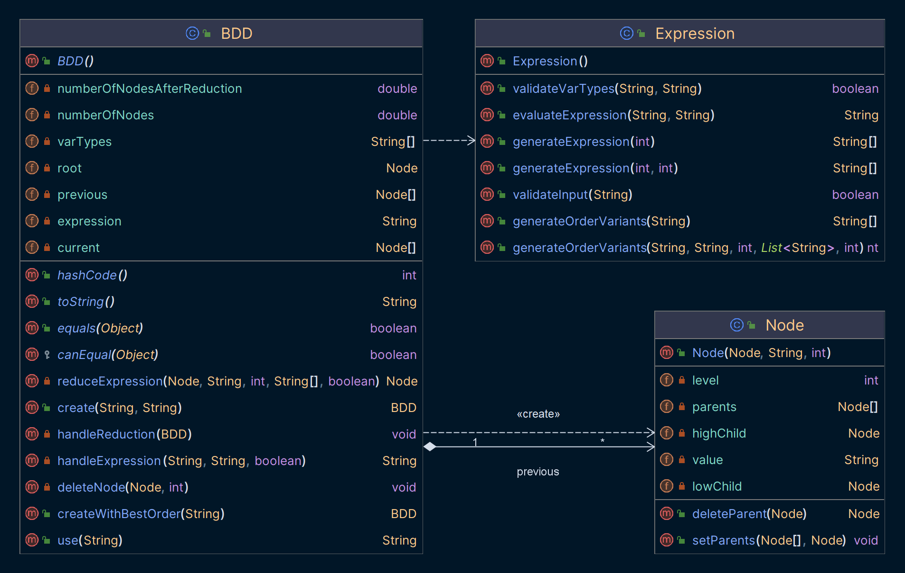
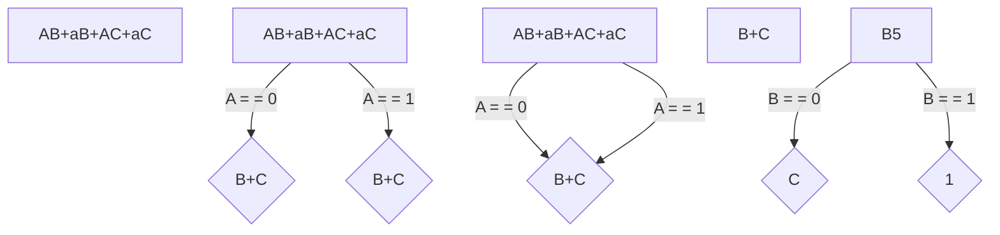
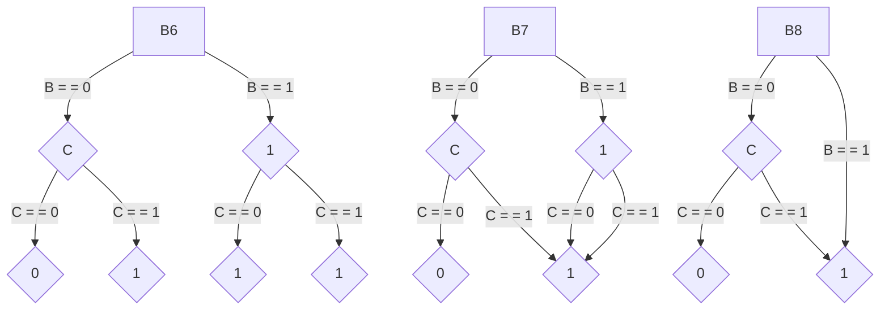

<style>
p, ul, li {
    font-size: 10pt;
    text-align: justify;
    line-height: 16pt;
}

td p {
    text-align: left;
}

pre {
    font-size: 8pt;
    margin: 0;
}

img {
    padding: 1pt;
}

hr {
    opacity: 0;
    page-break-after: always;
}

text {
    font-size: 8pt;
    line-height: 0;
}

.grid-2 {
    display: grid;
    grid-template-columns: repeat(2, minmax(0, 1fr));
    gap: 1.5rem
}

.grid-3 {
    display: grid;
    grid-template-columns: repeat(3, minmax(0, 1fr));
    gap: 1.5rem
}
</style>

# Content

- Introduction
- Implementation
    - `BDD_create(String expression, String order)`
    - `BDD_use(String input)`
    - Classes
        - `BDD`
            - `Node`
        - `Expression`
    - Example
- Testing
    - `BDD_create(String expression, String order)`
    - `BDD_use(String input)`
- Conclusion

# Introduction

The purpose of the second DSA task was to implement function logic in a program which has to create a Binary Decision
Diagram, to reduce it and also to use a relative input parameter - a vector.

## Used language

For this task I chose the language Java.

```powershell
PS C:\Users\kozub>java --version
openjdk 19.0.2 2023-01-17
OpenJDK Runtime Environment (build 19.0.2+7-44)
OpenJDK 64-Bit Server VM (build 19.0.2+7-44, mixed mode, sharing)
```

The reason for this is that I am more familiar with it and I have more
experience with it.

## Machine attributes

For testing - I decided to use a separate server from [GitHub Codespaces](https://github.com/features/codespaces), which
the loving GitHub provided us with for
free.

Below are the specifications of the processor on which our programme will be tested.

```
PS C:\Users\kozub> wmic cpu list /format:list
...
LoadPercentage=1
Manufacturer=GenuineIntel
MaxClockSpeed=2208
Name=Intel(R) Core(TM) i7-10870H CPU @ 2.20GHz
...
```

---

# Implementation

<div class="grid-2">

In my implementation I decided to create one BDD class with a Node, which is responsible for the whole structure and
reduction of the Binary Decision Diagram. The static Expression class is for additional functions, like generating
expressions and checking them. And also a Manager class - which provides the interaction interface and method execution.

<div>


_*Figure 1: Package structure_

</div>
</div>

## `BDD_create(String expression, String order)`

This method is responsible for creating a Binary Decision Diagram from a given expression and order. It returns a
reduced BDD.

> 📝 Memory complexity - **O(n)**
>
> ⌛ Time complexity - **O(n^3)**
> *By 3-timed cycle

### Code

[//]: # (@formatter:off)
```java
/**
 * Creates a BDD from an expression and a variable order
 *
 * @param expression Expression to be used
 * @param order      Variable order to be used
 * @return BDD created from the expression and variable order
 */
public BDD create(String expression, String order) {

    if (validateVarTypes(expression, order) || expression.isBlank())
        return null;

    this.expression = expression;
    this.varTypes = order.toUpperCase().split("");
    this.numberOfNodesAfterReduction = 1;

    this.previous = new Node[1];
    this.current = new Node[2];
    this.setRoot(this.previous[0] = new Node(null, this.expression, 0));

    for (int i = 0; i < this.varTypes.length; i++)
        this.numberOfNodes += Math.pow(2, i);

    int num, pos = 0;
    while (++pos <= this.varTypes.length) {
        num = 0;
        for (Node node : this.previous) {
            if (node == null)
                continue;

            Node low = reduceExpression(node, node.getValue(), pos, this.varTypes, true);
            Node high = reduceExpression(node, node.getValue(), pos, this.varTypes, false);

            node.setLowChild(this.current[num++] = low);
            node.setHighChild(this.current[num++] = high);

            if (pos != this.varTypes.length)
                this.numberOfNodesAfterReduction += 2;
        }

        handleReduction(this);
        this.previous = this.current;
        this.current = new Node[this.previous.length * 2];
    }

    return this;
}
```
[//]: # (@formatter:on)

### Algorithm

<div class="grid-2" style="row-gap: 0">

The first step creates the first node containing the complete Boolean function and declares it to be the root of the
diagram.

The second step creates another layer with two child nodes, the left one containing an expression after adding
value 0 after adding the variable A, and the right one, in turn, contains an expression after adding the value 1.

Since after each addition of a new value in my function, a reduction is performed - since everything corresponds -
type [I and type S reduction](https://arxiv.org/pdf/1710.06500v1.pdf) is performed. As in the following steps.

<div style="grid-row: span 3 / span 3; grid-row-start: 1; grid-column-start: 2;">





_*Figure 2: Algorithm of creating a BDD_

</div>
</div>

## `BDD_use(String input)`

This method is responsible for using the created BDD. It returns the result of the function for the given vector.

> 📝 Memory complexity - **O(n)**
>
> ⌛ Time complexity - **O(n)**
> *In the worst case, the algorithm will have to go through all the nodes of the BDD
>
> ⌛ Time complexity - **O(H)**
> *In the best case, the algorithm will have to go through only one path of the BDD, where H - height of the BDD

### Code

[//]: # (@formatter:off)
```java
/**
 * @param input Input for which the BDD is used
 * @return Result of using an input vector on the BDD
 */
public String use(String input) {
    String[] parts = input.split("");
    Node current = this.getRoot();
    int position = current.getLevel() - 1;

    if (parts.length != this.getVarTypes().length || !validateInput(input))
        return "-1";

    while (++position < this.getVarTypes().length) {
        int variable = current.getLevel();

        if (position == variable)
            current = parts[variable].equals("0")
                    ? current.getLowChild()
                    : current.getHighChild();
    }

    return current.getValue();
}
```
[//]: # (@formatter:on)

## Example of creating and using a BDD

[//]: # (@formatter:off)
```java
public static void main(String[] args) {
    String expression = "AB+aB+AC+aC";
    String order = "ABC";

    BDD bdd = new BDD(expression, order);
    bdd.create();
    
    System.out.println(bdd.use("000"));
}
```
[//]: # (@formatter:on)

# Testing

<br/>
<br/>
<br/>
<br/>
<br/>
<br/>
<br/>
<br/>
<br/>
<br/>
<br/>
<br/>
<br/>
<br/>
<br/>
<br/>
<br/>
<br/>
<br/>
<br/>
<br/>
<br/>
<br/>
<br/>
<br/>
<br/>
<br/>
<br/>
<br/>